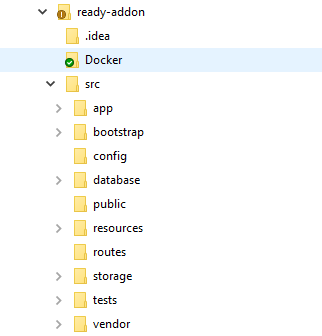
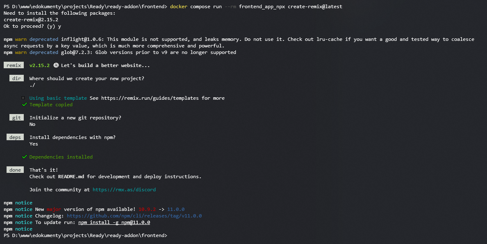

# Ready_™ Addon POC

### **Rozwiązanie bazuje na**

---

* https://medium.com/@iqbal.ramadhani55/make-your-first-laravel-project-7e87f9ad672f
* https://rezakhademix.medium.com/a-complete-guide-to-dockerize-laravel-postgres-nginx-mailserver-pgadmin-adminer-redis-npm-45dbf0fe188a
* https://github.com/rezakhademix/laravel-postgres-docker/tree/main

### Przykładowe repozytorium z obrazem

---

https://github.com/tomek-swienty/ready-addon

### **Wymagane narzędzia**

---

* https://www.docker.com/
* https://git-scm.com/downloads

Nie musisz mieć lokalnie php etc 😎

### **Ważne**

---

Na cele testów posłuży moje repo ale na przyszł zrób swoje (fork)  👍

### Klonowanie projektu

---

Przejdź do katalogu gdzie chcesz rozwijać swój addon i sklonuj przykładowy projekt

```
gh repo clone tomek-swienty/ready-addon
```

### Budowa kontenerów

---

Przejdź do głównego katalogu czyli tam gdzie nastąpiło klonowanie repo i jest plik docker-compose.yml i wykonaj

```
docker-compose up -d --build
```

To buduje obraz plus kontenery - trochę potrwa

### Inicjalizacja repozytorium rozszerzenia

---

<span style="color:red">Nie wykonuj tego ponownie jeśli Twoje rozszerzenie ma już kod!</span>.

Inicjalizacja projektu laravel:

1. Przejdź do katalogu backend\app
2. Usuwamy wszystko (łącznie z plikami gitignore itd)
3. Wpisz

```
docker compose run --rm backend_composer create-project --prefer-dist laravel/laravel .
```

```
docker compose run --rm backend_composer require laravel/breeze
```

```
docker compose run --rm backend_composer require laravel/sanctum
```

```
docker compose run --rm backend_artisan breeze:install
```

Komenda utworzy szkielet aplikacji w bieżącym katalogu.

Oczekiwany rezultat






Instalacja bibliotek react

```
docker compose run --rm frontend_app init -y
```

```
docker compose run --rm frontend_app install 
```

```
docker compose run --rm frontend_app run build 
```

```
docker compose run --rm frontend_app  build 
```


Wszystko z poziomu katalogu ready-addon

Kontenery
docker compose up -d --build


Laravel
docker compose run --rm backend_composer create-project --prefer-dist laravel/laravel .


///
docker compose run --rm backend_composer install

docker compose run --rm backend_artisan migrate

docker compose run --rm backend_artisan key:generate

docker compose run --rm backend_artisan jwt:secret